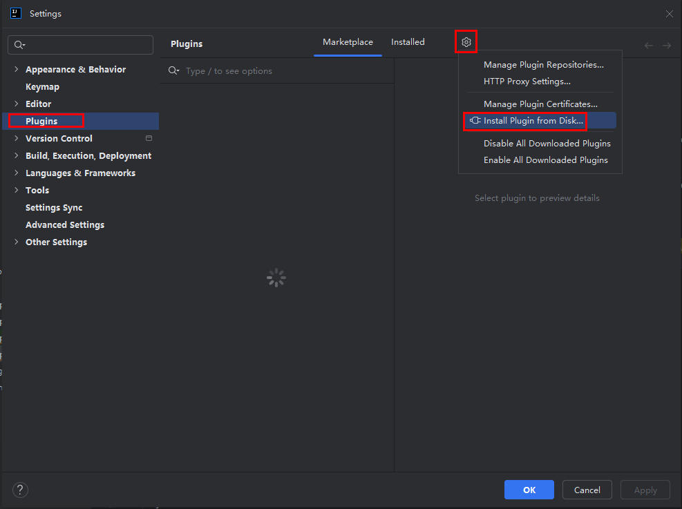
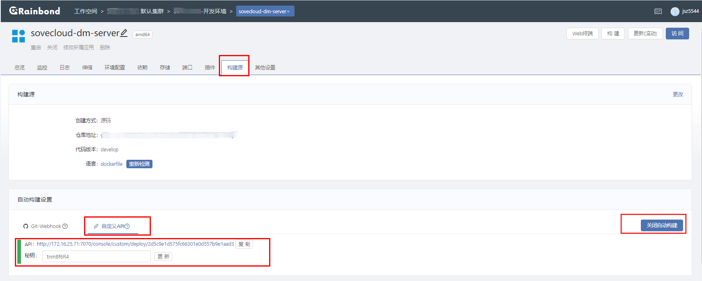
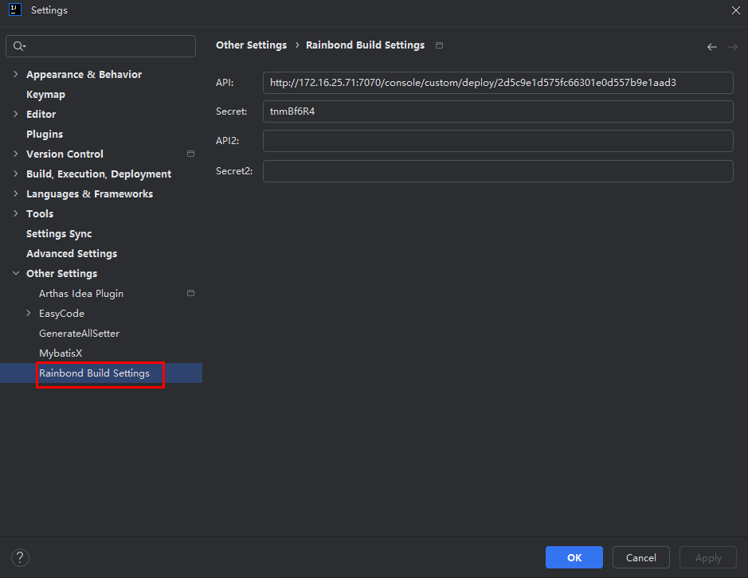
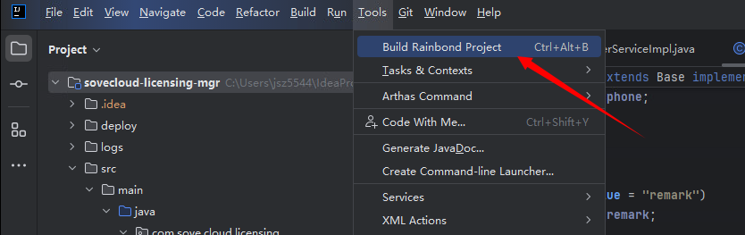
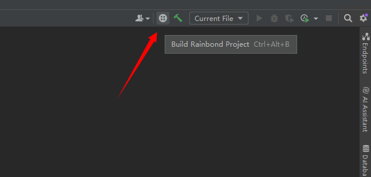
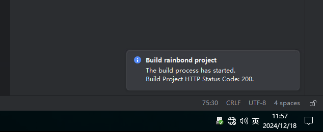
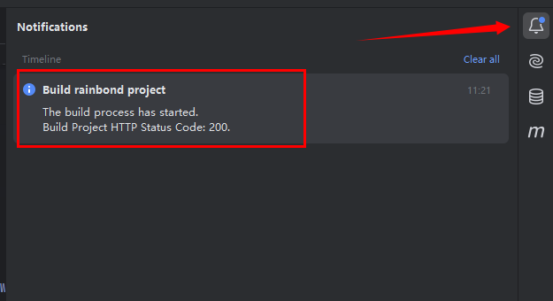

# build-rainbond-project

这是一个在IDEA中构建Rainbond组件的插件。

它允许您在IDEA中配置组件API和Secret来达到无需离开IDEA编辑器就能构建Rainbond组件。

## 支持的IDE

基于Jetbrains官方文档开发，理论适配Jetbrains全家桶！

>支持2024.3 及以下版本！

## 插件安装

### 离线安装

访问Github下载最新版本的离线安装包。按照以下方式进行安装。

### 在线安装

## 插件配置

### rainbond 平台

在组件详细页面中选择`构建源`，在`自动构建设置`模块中选择`自定义API`,然后打开`自动构建`,就会出现如下图所示的`API`和`密钥`.

### IDEA 中配置

在`File -> Settings -> Other Settings -> Rainbond Build Settings`菜单下。

填写上一步在rainbond平台中查询到的`webhook API 和密钥`

>目前插件只支持同时填写2个组件的API和密钥。

## 使用方式

### 方式一

在菜单栏中的`Tools`选项中点击`Build Rainbond Project`按钮。

### 方式二

在工具栏中点击`Build Rainbond Project`按钮。

>IDEA 旧版UI中可以找到按钮，新版中不显示此按钮。

### 方式三

使用快捷键 `Ctl+Alt+B`

## 构建通知

在使用快捷键或按钮构建完成后会使用以下两种方式进行构建结果的提示！如下图所示:

**底部消息栏**

**通知中心**

>构建出现错误也会在构建提示中显示。
>
>如果出现正常构建Http状态码是409的情况，说明已经在构建中了，请稍后再操作。

